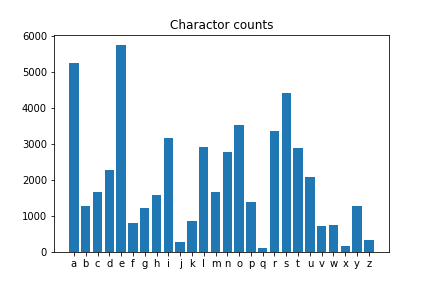

# Wordle_solver
A solver for `Wordle` game written in Python.

## How to use

This program runs on a shell.

Type the displayed word into `Wordle`, and enter the returned results (hints) into the shell.

The hints should be entered as five-digit numbers, using the numbers 0 - 2.

0. Gray ⬜ (not in the word in any spot)
1. Yellow 🟨 (in the word but in the wrong spot)
2. Green 🟩 (not in the word in any spot)

If the word displayed in the shell does not exist in Wordle's dictionary, enter any value (excluding 5-digit numbers, 5-character words and `e`), and the next candidate will be displayed.

### Example (Wordle 11)

```shell
hogehoge> python wordle_solver.py # 1
Enter:  arose
Results?: 11000     # 2
Enter:  intra
Results?: 00021
Enter:  luard
Results?: 1         # 3
Enter:  guard       # 4
Results?: 00221
Enter:  dwarf
Results?: e         # 5
hogehoge> 
```

1. `python wordle_solver.py` to activate.
2. The result for `arose` was 🟨🟨⬜⬜⬜, so you'll enter `11000`.
3. Since `luard` does not exist in the `Wordle`'s dictionary, we will enter `1` for now.
4. Then, `guard` was displayed as the next candidate.
5. You've successfully arrived as the answer `dwarf`! Type `e` to finish.

## About algorithm

### dictionary

We took all the words in [Project Gutenberg](https://www.gutenberg.org/)'s TOP 100 novels (with some missing) and extract only those with 5 letters from them to create a dictionary for `Wordle`. (`wordle_dict.pkl`)

The dictionary data containing words of all character counts can be downloaded from this [Japanese page](https://ushitora.net/archives/456).

### word selection

The percentage of characters present in the above dictionary is shown in the figure below.



The solver select words in the following way

1. Exclude words that do not fit the hints.
2. The word should contain letters with high frequency of occurrence
3. The word should contain a large number of different letters.

Based on these criteria, the solver calculate a score for each word, and recommend them in order of their value.